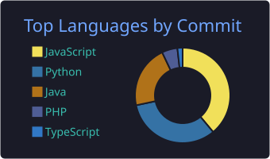

# Lucas Vasconcelos

**Desenvolvedor Backend | Java · Spring Boot · Python · PostgreSQL**

Sou de Águas Lindas de Goiás - GO, tenho 21 anos e me formo em Análise e Desenvolvimento de Sistemas (Unieuro) em dezembro de 2026.
Construo sistemas backend, automações e soluções com IA aplicada.

📌 **Aberto a oportunidades como Desenvolvedor Backend Júnior / Estágio.**

---

## 💼 Experiência

- **Fábrica de Software Unieuro** (fev–jul 2026): desenvolvimento backend e banco de dados
- **RPA em ambiente fiscal corporativo:** automação de processos com foco em redução de trabalho manual

## 🚀 Projetos em destaque

| Projeto | O que faz | Stack |
|---|---|---|
| [Sexta-Feira](link) | Assistente de IA local com dupla arquitetura de LLMs e detecção de wake word offline | Python |
| [Análise Fiscal Distribuída](link) | Processador de notas fiscais com multiprocessing e otimização de desempenho | Python |
| [Sistema Hospitalar](link) | Gestão hospitalar com análise de concorrência | Java, Spring Boot |
| [UniTinder](link) | Plataforma de match de estágios | TypeScript, React, node.js |

## 🛠️ Stack

**Backend:** Java, Spring Boot, Python, Node.js, TypeScript

**Frontend:** React, TypeScript

**Dados:** PostgreSQL

**Ferramentas:** Git, Docker

## 📊 GitHub

  

## 📫 Contato

[LinkedIn](https://www.linkedin.com/in/dev-lucas-vasconcelos) · [E-mail](mailto:lucasvscxl@gmail.com)
